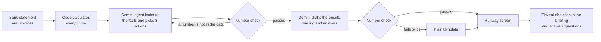

# Runway

**An AI financial assistant for small businesses. It watches the money, warns early, and does the admin to fix it.**

**Live demo:** [Runway](https://runwayy.streamlit.app/) · **Code:** [github.com/foysalbinislam/runway-hackathon](https://github.com/foysalbinislam/runway-hackathon)

> **Sample data only.** Bradford Auto Care, its customers and its suppliers are fictional. No bank is connected, and no email is ever sent.

## Contributors

This project was developed collaboratively by:

* **Foysal** — [@YOURUSERNAME](https://github.com/foysalbinislam)
* **Efaz** — [@efaz646](https://github.com/efaz646)

## The problem

Small businesses rarely fail suddenly. They fail because money problems are spotted too late. Garage owners, shopkeepers and venue managers are busy doing the actual work, and nobody is watching the bank statement until it's too late.

## What Runway does

Meet Dave, who runs **Bradford Auto Care**, a small garage in Bradford. Runway reads his messy bank statement and invoices and:

1. **Warns him early.** It forecasts his cash week by week and finds that **cash runs short in week 5**, when VAT and his parts bill land in the same week.
2. **Chases late payers.** Three customers owe him **£5,575.50**. Runway drafts a reminder to each, friendly or firm depending on how late they are. If they pay this week, Dave never runs short.
3. **Checks his bills.** His September electricity bill was **£1,236.80**, against a usual **£391.30**. Runway flags it, suggests what to do, and drafts the query email.
4. **Talks to him.** A 30-second spoken morning briefing, and Dave can ask out loud: *"Who owes me money?"*

Dave stays in control: Runway drafts every email but **never sends anything**.

## How it works

**Code calculates. Gemini decides and writes. Code checks.**



* **Gemini is the brain.** It works as an AI agent: it calls Runway's tools (`get_cash_forecast`, `get_unpaid_invoices`, `get_supplier_bills`) to look up the facts, decides the top three actions, and writes every email, the briefing and the answers.
* **ElevenLabs is the voice.** Text-to-speech reads the briefing and answers aloud. Speech-to-text understands spoken questions.
* **The AI never makes up a number.** Every amount, date and week is calculated in code. Any number Gemini writes that isn't in the data is sent back to be fixed, and if it fails twice, a plain template is used instead.
* **The demo never breaks.** If Gemini or ElevenLabs fails, Runway shows its last verified analysis, a saved recording, or the text version, and says so on screen.

## Built with

| Part            | Technology                                                                       |
| --------------- | -------------------------------------------------------------------------------- |
| App and logic   | Python, Streamlit                                                                |
| Data and charts | pandas, Altair                                                                   |
| AI agent        | Google Gemini (`google-genai`, function calling)                                 |
| Voice           | ElevenLabs text-to-speech (`eleven_flash_v2_5`) and speech-to-text (`scribe_v2`) |
| Tests           | pytest, with simulated Gemini and ElevenLabs                                     |
| Hosting         | Streamlit Community Cloud                                                        |

## Run it on your computer

You need **Python 3.11 or newer** and two API keys: one from [Google AI Studio](https://aistudio.google.com) and one from [ElevenLabs](https://elevenlabs.io).

### 1. Get the code

```bash
git clone https://github.com/YOURUSERNAME/runway-hackathon.git
cd runway-hackathon
```

### 2. Add your keys

Create a file called `.env` in the project folder with these two lines:

```env
GEMINI_API_KEY=your-gemini-key
ELEVENLABS_API_KEY=your-elevenlabs-key
```

`.env` is git-ignored, so your keys are never uploaded to GitHub.

### 3. Start the app

**Windows:** double-click `run_windows.bat`.

**Mac, Linux or Windows by hand:**

```bash
python -m venv .venv
source .venv/bin/activate
pip install -r requirements-dev.txt
python llm.py
python voice.py
streamlit run app.py
```

Then open `http://localhost:8501`.

In the app, check that both keys show ✅ in the sidebar, then press **Load Dave's sample data**.

## Deploy on Streamlit Community Cloud

1. Go to [Streamlit Community Cloud](https://share.streamlit.io), sign in with GitHub, and choose **Create app**.
2. Select repository `YOURUSERNAME/runway-hackathon`, branch `main`, and main file **`app.py`**.
3. Under **Advanced settings**, choose Python 3.12 and add the following secrets:

```toml
GEMINI_API_KEY = "your-gemini-key"
ELEVENLABS_API_KEY = "your-elevenlabs-key"
```

4. Press **Deploy**.

Every `git push` to `main` updates the live app.

## Make it your own

The owner, business and town are set in one place near the top of `config.py`:

```python
BUSINESS_NAME = "Bradford Auto Care"
OWNER_NAME = "Dave"
BUSINESS_TYPE = "a small garage"
TOWN = "Bradford, Yorkshire"
```

Change them, save, and push. The new names appear throughout the application, including the load button, agent, email sign-offs and spoken briefing.

## The demo

1. Open **Dave's bank export, as downloaded (messy)**.
2. Press **Load Dave's sample data**. Runway's agent works live and warns: *cash runs short in week 5*.
3. Read out the three actions under **What Runway recommends**.
4. Press **Open 3 draft reminders**. Nothing is sent.
5. Press **Play the 30-second briefing**, then ask *"Who owes me money?"* under **Ask Runway**.
6. Open **What Runway's agent did** to show the agent's steps.

### Before presenting

Open the app 10 minutes early, load the data once so the fallback is saved, turn the sound up, and allow the microphone.

Use the sidebar switches **Pretend Gemini is down** and **Pretend ElevenLabs is down** to rehearse the fallback behaviour.

## Sample data and known answers

The sample data is built with known answers, so every result can be checked. "Today" in the data is Monday 5 October 2026.

| Check            | Known answer                                                                                                                            |
| ---------------- | --------------------------------------------------------------------------------------------------------------------------------------- |
| Cash today       | £3,600.00                                                                                                                               |
| Cash runs short  | Week 5 (week of 2 Nov), balance -£1,952.24                                                                                              |
| Why week 5       | VAT (£4,600.00) and the parts account (£2,450.35) both fall due                                                                         |
| Overdue invoices | Exactly 3: Shipley Van Hire £2,475.00 (49 days), Calder Plumbing & Heating £1,240.50 (31 days), Wharfe Valley Taxis £1,860.00 (12 days) |
| Not yet due      | Bingley Florists £385.00, Airedale Couriers £1,120.00                                                                                   |
| Bill spikes      | Exactly 1: September electricity, £1,236.80 against a usual £391.30                                                                     |

## Tests

```bash
pytest -q
```

This runs the offline test suite without requiring API keys.

For live tests:

```bash
pytest -q tests/test_live.py -s
```

The offline tests use simulated versions of Gemini and ElevenLabs that can be told to make mistakes, such as inventing a number, to prove Runway catches them.

## Troubleshooting

| Problem                        | Fix                                                                                                                                  |
| ------------------------------ | ------------------------------------------------------------------------------------------------------------------------------------ |
| `No module named 'google'`     | The packages aren't installed for the Python you used. Use `run_windows.bat`, or run `.venv\Scripts\python -m streamlit run app.py`. |
| Keys show ❌ missing            | Check the file is named exactly `.env`, not `.env.txt`, and is in the same folder as `app.py`.                                       |
| Gemini authentication error    | Check that the API key is valid and has access to the selected Gemini model.                                                         |
| Keys show ❌ on Streamlit Cloud | Check the Secrets use quotes, then choose **⋮ → Reboot app**.                                                                        |
| Gemini or ElevenLabs is down   | The app keeps working with its saved run or text fallbacks and labels them on screen.                                                |

## Project structure

```text
├── app.py                 # the one-screen Streamlit app
├── forecast.py            # cleans the bank data and calculates the cash forecast
├── chaser.py              # finds overdue invoices and drafts reminders
├── bills.py               # finds bill spikes and drafts query/payment-delay emails
├── llm.py                 # Gemini agent, number checking and fallbacks
├── voice.py               # ElevenLabs briefing and spoken questions
├── config.py              # names, thresholds, models and API keys
├── make_sample_data.py    # builds Dave's sample data
├── bank_statement.csv     # sample bank data
├── invoices.csv           # sample invoice data
├── run_windows.bat        # one-click Windows start
├── requirements.txt       # application packages
├── requirements-dev.txt   # application packages plus pytest
├── Dockerfile             # optional container
├── .streamlit/            # Streamlit configuration
└── tests/                 # offline tests, live tests and simulated APIs
```

## Next steps

* Pilot Runway with local Yorkshire businesses.
* Connect to accounting software through read-only integrations.
* Expand the financial insights and forecasting capabilities.
